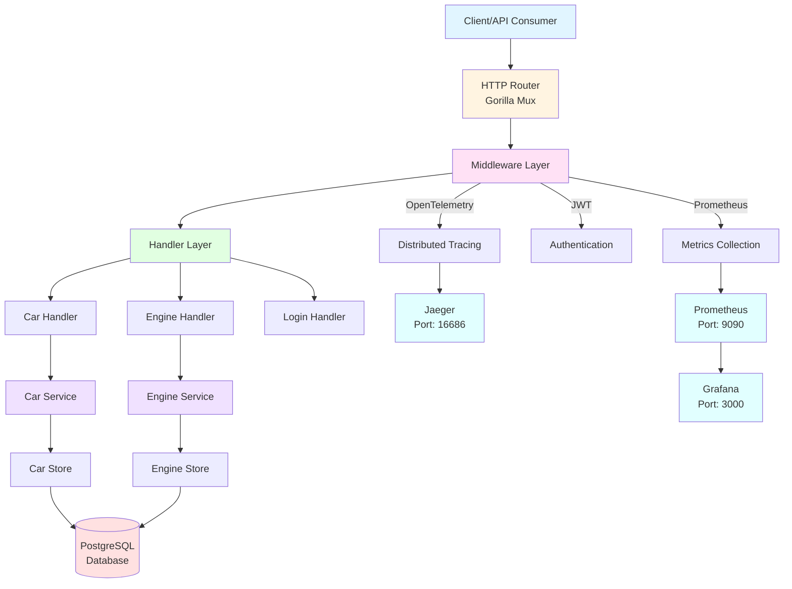
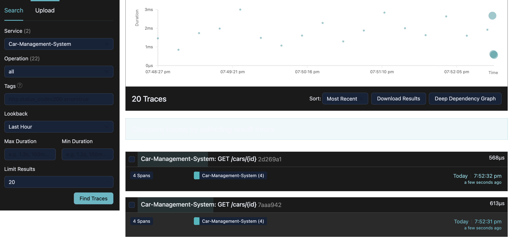
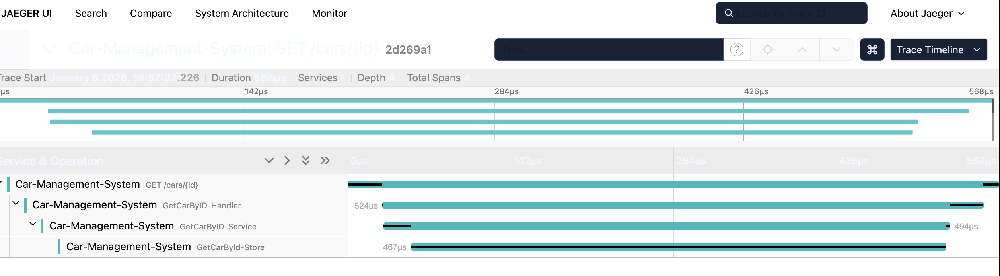
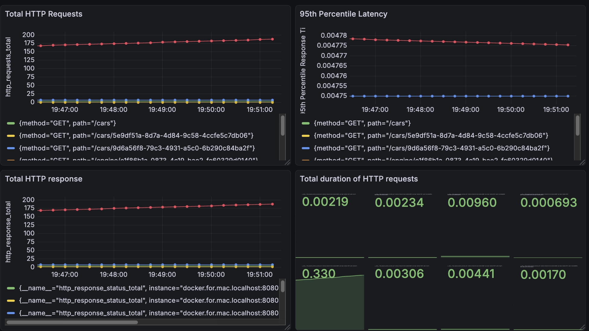

# Car Management System

A comprehensive RESTful API system for managing cars and engines, built with Go. This project demonstrates modern microservices architecture patterns including distributed tracing, metrics collection, and monitoring capabilities.

## 📋 Table of Contents

- [Overview](#overview)
- [Features](#features)
- [Architecture](#architecture)
- [Tech Stack](#tech-stack)
- [Project Structure](#project-structure)
- [Prerequisites](#prerequisites)
- [Getting Started](#getting-started)
- [API Endpoints](#api-endpoints)
- [Observability](#observability)
- [Database Schema](#database-schema)
- [Environment Variables](#environment-variables)
- [Usage Examples](#usage-examples)

## 🎯 Overview

The Car Management System is a Go-based REST API that provides comprehensive CRUD operations for managing cars and their associated engines. The system includes:

- **Authentication**: JWT-based authentication for secure API access
- **Distributed Tracing**: OpenTelemetry integration with Jaeger for request tracing
- **Metrics Collection**: Prometheus metrics for monitoring application performance
- **Visualization**: Grafana dashboards for metrics visualization
- **Database**: PostgreSQL for persistent data storage
- **Docker**: Containerized deployment with Docker Compose

## ✨ Features

- ✅ Full CRUD operations for Cars and Engines
- ✅ JWT-based authentication and authorization
- ✅ Request tracing with OpenTelemetry and Jaeger
- ✅ Prometheus metrics collection
- ✅ Grafana dashboards for visualization
- ✅ RESTful API design
- ✅ Input validation
- ✅ Database relationships (Cars ↔ Engines)
- ✅ Docker containerization
- ✅ Middleware for authentication and metrics

## 🏗️ Architecture

The system follows a layered architecture pattern:

### Architecture Diagram



### System Flow

```
┌─────────────────────────────────────────────────────────────┐
│                        Client/API Consumer                  │
└────────────────────────────┬────────────────────────────────┘
                             │
                             ▼
┌─────────────────────────────────────────────────────────────┐
│                    HTTP Router (Gorilla Mux)                │
│  ┌──────────────────────────────────────────────────────┐   │
│  │  Middleware Layer                                    │   │
│  │  • OpenTelemetry Tracing                             │   │
│  │  • Prometheus Metrics                                │   │
│  │  • JWT Authentication                                │   │
│  └──────────────────────────────────────────────────────┘   │
└────────────────────────────┬────────────────────────────────┘
                             │
                             ▼
┌─────────────────────────────────────────────────────────────┐
│                    Handler Layer                            │
│  ┌──────────────┐  ┌──────────────┐  ┌──────────────┐       │
│  │ Car Handler  │  │Engine Handler│  │Login Handler │       │
│  └──────┬───────┘  └──────┬───────┘  └──────────────┘       │
└─────────┼──────────────────┼────────────────────────────────┘
          │                  │
          ▼                  ▼
┌─────────────────────────────────────────────────────────────┐
│                    Service Layer                            │
│  ┌──────────────┐  ┌──────────────┐                         │
│  │ Car Service  │  │Engine Service│                         │
│  └──────┬───────┘  └──────┬───────┘                         │
└─────────┼──────────────────┼────────────────────────────────┘
          │                  │
          ▼                  ▼
┌─────────────────────────────────────────────────────────────┐
│                    Store Layer (Repository)                 │
│  ┌──────────────┐  ┌──────────────┐                         │
│  │ Car Store    │  │Engine Store  │                         │
│  └──────┬───────┘  └──────┬───────┘                         │
└─────────┼──────────────────┼────────────────────────────────┘
          │                  │
          └──────────┬───────┘
                     ▼
┌─────────────────────────────────────────────────────────────┐
│                    PostgreSQL Database                      │
└─────────────────────────────────────────────────────────────┘

┌─────────────────────────────────────────────────────────────┐
│              Observability Stack                            │
│  ┌──────────────┐  ┌──────────────┐  ┌──────────────┐       │
│  │    Jaeger    │  │  Prometheus  │  │   Grafana    │       │
│  │  (Tracing)   │  │  (Metrics)   │  │(Visualization)│      │
│  └──────────────┘  └──────────────┘  └──────────────┘       │
└─────────────────────────────────────────────────────────────┘
```

### Architecture Components

1. **Handler Layer**: HTTP request handlers that process incoming requests
2. **Service Layer**: Business logic and validation
3. **Store Layer**: Database access and data persistence
4. **Middleware**: Cross-cutting concerns (auth, metrics, tracing)
5. **Observability**: Distributed tracing, metrics, and visualization

## 🛠️ Tech Stack

- **Language**: Go 1.25.5
- **Web Framework**: Gorilla Mux
- **Database**: PostgreSQL
- **Authentication**: JWT (golang-jwt/jwt)
- **Tracing**: OpenTelemetry with Jaeger
- **Metrics**: Prometheus
- **Visualization**: Grafana
- **Containerization**: Docker & Docker Compose
- **Environment Management**: godotenv

## 📁 Project Structure

```
Car-Management-System/
├── db/
│   └── Dockerfile              # PostgreSQL database Dockerfile
├── driver/
│   └── postgres.go            # Database connection driver
├── handler/
│   ├── car/
│   │   └── car.go             # Car HTTP handlers
│   ├── engine/
│   │   └── engine.go          # Engine HTTP handlers
│   └── login/
│       └── login.go           # Authentication handler
├── middleware/
│   ├── auth_middleware.go     # JWT authentication middleware
│   └── metrices_middleware.go # Prometheus metrics middleware
├── models/
│   ├── car.go                 # Car data models and validation
│   ├── engine.go              # Engine data models
│   └── login.go               # Login credentials model
├── service/
│   ├── car/
│   │   └── car.go             # Car business logic
│   ├── engine/
│   │   └── engine.go          # Engine business logic
│   └── interface.go           # Service interfaces
├── store/
│   ├── car/
│   │   └── car.go             # Car database operations
│   ├── engine/
│   │   └── engine.go          # Engine database operations
│   ├── interface.go           # Store interfaces
│   └── schema.sql             # Database schema and seed data
├── observability_images/      # Observability screenshots
│   ├── grafana_dashboard.png
│   ├── jaeger_trace.png
│   └── jaeger_ui.png
├── docker-compose.yml         # Multi-container orchestration
├── Dockerfile                 # Application Dockerfile
├── prometheus.yml             # Prometheus configuration
├── go.mod                     # Go module dependencies
├── go.sum                     # Go module checksums
└── main.go                    # Application entry point
```

## 📦 Prerequisites

Before you begin, ensure you have the following installed:

- **Go** (version 1.25.5 or higher)
- **Docker** and **Docker Compose**
- **PostgreSQL** (if running locally without Docker)
- **Git**

## 🚀 Getting Started

### 1. Clone the Repository

```bash
git clone <repository-url>
cd Car-Management-System
```

### 2. Environment Setup

Create a `.env` file in the root directory:

```env
PORT=8080
DB_HOST=db
DB_PORT=5432
DB_USER=postgres
DB_PASSWORD=12345
DB_NAME=postgres
JAEGER_AGENT_HOST=jaeger
JAEGER_AGENT_PORT=4318
```

### 3. Run with Docker Compose (Recommended)

The easiest way to run the entire stack:

```bash
docker-compose up --build
```

This will start:
- **Application** on port `8080`
- **PostgreSQL** on port `5432`
- **Jaeger** UI on port `16686`
- **Prometheus** on port `9090`
- **Grafana** on port `3000`

### 4. Run Locally (Without Docker)

If you prefer to run locally:

1. **Start PostgreSQL** (or use Docker for DB only):
   ```bash
   docker run -d \
     --name postgres \
     -e POSTGRES_USER=postgres \
     -e POSTGRES_PASSWORD=12345 \
     -e POSTGRES_DB=postgres \
     -p 5432:5432 \
     postgres:latest
   ```

2. **Start Jaeger**:
   ```bash
   docker run -d \
     --name jaeger \
     -p 6831:6831/udp \
     -p 4318:4318 \
     -p 14268:14268 \
     -p 16686:16686 \
     jaegertracing/all-in-one:latest
   ```

3. **Start Prometheus**:
   ```bash
   docker run -d \
     --name prometheus \
     -p 9090:9090 \
     -v $(pwd)/prometheus.yml:/etc/prometheus/prometheus.yml \
     prom/prometheus:latest
   ```

4. **Start Grafana**:
   ```bash
   docker run -d \
     --name grafana \
     -p 3000:3000 \
     -e GF_SECURITY_ADMIN_PASSWORD=admin \
     grafana/grafana:latest
   ```

5. **Run the Application**:
   ```bash
   go mod download
   go run main.go
   ```

## 📡 API Endpoints

### Authentication

#### Login
```http
POST /login
Content-Type: application/json

{
  "username": "admin",
  "password": "admin123"
}
```

**Response:**
```json
{
  "token": "eyJhbGciOiJIUzI1NiIsInR5cCI6IkpXVCJ9..."
}
```

**Note**: All endpoints below require authentication. Include the token in the Authorization header:
```
Authorization: Bearer <token>
```

### Car Endpoints

#### Get Car by ID
```http
GET /cars/{id}
Authorization: Bearer <token>
```

#### Get Cars by Brand
```http
GET /cars?brand={brand}&isEngine={true|false}
Authorization: Bearer <token>
```

**Query Parameters:**
- `brand`: Filter by car brand (required)
- `isEngine`: Include engine details (optional, default: false)

#### Create Car
```http
POST /cars
Authorization: Bearer <token>
Content-Type: application/json

{
  "Name": "Honda Civic",
  "year": "2023",
  "brand": "Honda",
  "fuel_type": "Petrol",
  "engine": {
    "engine_id": "e1f86b1a-0873-4c19-bae2-fc60329d0140",
    "displacement": 2000,
    "no_of_cylinders": 4,
    "car_range": 600
  },
  "price": 25000.00
}
```

#### Update Car
```http
PUT /cars/{id}
Authorization: Bearer <token>
Content-Type: application/json

{
  "Name": "Honda Civic Updated",
  "year": "2024",
  "brand": "Honda",
  "fuel_type": "Petrol",
  "engine": {
    "engine_id": "e1f86b1a-0873-4c19-bae2-fc60329d0140",
    "displacement": 2000,
    "no_of_cylinders": 4,
    "car_range": 600
  },
  "price": 26000.00
}
```

#### Delete Car
```http
DELETE /cars/{id}
Authorization: Bearer <token>
```

### Engine Endpoints

#### Get Engine by ID
```http
GET /engine/{id}
Authorization: Bearer <token>
```

#### Create Engine
```http
POST /engine
Authorization: Bearer <token>
Content-Type: application/json

{
  "displacement": 2000,
  "no_of_cylinders": 4,
  "car_range": 600
}
```

#### Update Engine
```http
PUT /engine/{id}
Authorization: Bearer <token>
Content-Type: application/json

{
  "displacement": 2500,
  "no_of_cylinders": 6,
  "car_range": 700
}
```

#### Delete Engine
```http
DELETE /engine/{id}
Authorization: Bearer <token>
```

### Metrics Endpoint

#### Prometheus Metrics
```http
GET /metrics
```

Returns Prometheus-formatted metrics for monitoring.

## 📊 Observability

The system includes comprehensive observability features:

### Distributed Tracing with Jaeger

All HTTP requests are automatically traced using OpenTelemetry and sent to Jaeger. You can view traces at:

**Jaeger UI**: http://localhost:16686



**Trace Details**:


### Metrics with Prometheus

Prometheus collects metrics from the application:

**Prometheus UI**: http://localhost:9090

Available metrics:
- `http_requests_total`: Total number of HTTP requests
- `http_requests_duration_seconds`: Request duration histogram
- `http_response_status_total`: Response status code counters

### Visualization with Grafana

Grafana provides visual dashboards for metrics:

**Grafana UI**: http://localhost:3000

**Default Credentials**:
- Username: `admin`
- Password: `admin`



### Setting up Grafana Data Source

1. Login to Grafana at http://localhost:3000
2. Go to **Configuration** → **Data Sources**
3. Click **Add data source**
4. Select **Prometheus**
5. Set URL to `http://prometheus:9090` (or `http://localhost:9090` if running locally)
6. Click **Save & Test**

## 🗄️ Database Schema

### Engine Table

```sql
CREATE TABLE engine (
    id UUID PRIMARY KEY,
    displacement INT NOT NULL,
    no_of_cylinders INT NOT NULL,
    car_range INT NOT NULL,
    created_at TIMESTAMP DEFAULT CURRENT_TIMESTAMP,
    updated_at TIMESTAMP DEFAULT CURRENT_TIMESTAMP
);
```

### Car Table

```sql
CREATE TABLE car (
    id UUID PRIMARY KEY,
    name VARCHAR(255) NOT NULL,
    year VARCHAR(4) NOT NULL,
    brand VARCHAR(255) NOT NULL,
    fuel_type VARCHAR(50) NOT NULL,
    engine_id UUID NOT NULL,
    price DECIMAL(10, 2) NOT NULL,
    created_at TIMESTAMP DEFAULT CURRENT_TIMESTAMP,
    updated_at TIMESTAMP DEFAULT CURRENT_TIMESTAMP,
    FOREIGN KEY (engine_id) REFERENCES engine(id) ON DELETE CASCADE
);
```

### Seed Data

The schema includes seed data with sample cars and engines that are automatically loaded on startup.

## 🔐 Environment Variables

| Variable | Description | Default |
|----------|-------------|---------|
| `PORT` | Application server port | `8080` |
| `DB_HOST` | PostgreSQL host | `db` |
| `DB_PORT` | PostgreSQL port | `5432` |
| `DB_USER` | Database username | `postgres` |
| `DB_PASSWORD` | Database password | `12345` |
| `DB_NAME` | Database name | `postgres` |
| `JAEGER_AGENT_HOST` | Jaeger agent host | `jaeger` |
| `JAEGER_AGENT_PORT` | Jaeger agent port | `4318` |

## 💡 Usage Examples

### Example 1: Complete Car Creation Flow

```bash
# 1. Login to get token
TOKEN=$(curl -X POST http://localhost:8080/login \
  -H "Content-Type: application/json" \
  -d '{"username":"admin","password":"admin123"}' \
  | jq -r '.token')

# 2. Create an engine first
ENGINE_ID=$(curl -X POST http://localhost:8080/engine \
  -H "Authorization: Bearer $TOKEN" \
  -H "Content-Type: application/json" \
  -d '{
    "displacement": 2000,
    "no_of_cylinders": 4,
    "car_range": 600
  }' | jq -r '.id')

# 3. Create a car with the engine
curl -X POST http://localhost:8080/cars \
  -H "Authorization: Bearer $TOKEN" \
  -H "Content-Type: application/json" \
  -d "{
    \"Name\": \"Tesla Model 3\",
    \"year\": \"2024\",
    \"brand\": \"Tesla\",
    \"fuel_type\": \"Electric\",
    \"engine\": {
      \"engine_id\": \"$ENGINE_ID\",
      \"displacement\": 2000,
      \"no_of_cylinders\": 4,
      \"car_range\": 600
    },
    \"price\": 45000.00
  }"
```

### Example 2: Query Cars by Brand

```bash
# Get token
TOKEN=$(curl -X POST http://localhost:8080/login \
  -H "Content-Type: application/json" \
  -d '{"username":"admin","password":"admin123"}' \
  | jq -r '.token')

# Get all Honda cars with engine details
curl -X GET "http://localhost:8080/cars?brand=Honda&isEngine=true" \
  -H "Authorization: Bearer $TOKEN"
```

### Example 3: View Metrics

```bash
# View Prometheus metrics
curl http://localhost:8080/metrics
```

## 🧪 Testing

### Manual Testing with cURL

```bash
# Test login endpoint
curl -X POST http://localhost:8080/login \
  -H "Content-Type: application/json" \
  -d '{"username":"admin","password":"admin123"}'

# Test protected endpoint (replace <token> with actual token)
curl -X GET http://localhost:8080/cars \
  -H "Authorization: Bearer <token>"
```

## 📝 Notes

- **Authentication**: Default credentials are `admin`/`admin123`. In production, use secure password management.
- **JWT Secret**: The JWT secret key is hardcoded in the middleware. In production, use environment variables.
- **Database**: The schema is automatically executed on application startup.
- **Tracing**: All requests are automatically traced. Ensure Jaeger is running for tracing to work.
- **Metrics**: Metrics are exposed at `/metrics` endpoint in Prometheus format.

## 🤝 Contributing

1. Fork the repository
2. Create your feature branch (`git checkout -b feature/AmazingFeature`)
3. Commit your changes (`git commit -m 'Add some AmazingFeature'`)
4. Push to the branch (`git push origin feature/AmazingFeature`)
5. Open a Pull Request

## 📄 License

This project is open source and available under the MIT License.

## 👤 Author

Car Management System - A demonstration of modern Go microservices architecture with observability.

---

**Happy Coding! 🚀**
